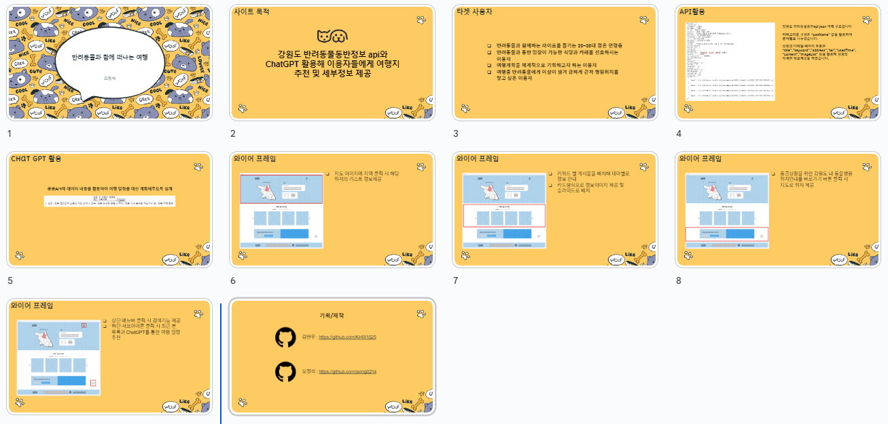
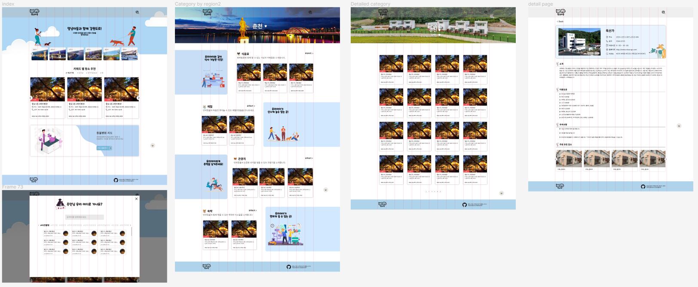

## 
 강원도API 활용 리액트기반 반응형 웹사이트 

###### 
클릭 시 데모 사이트 이동  👇

---

### 📋프로젝트 소개

강원도 반려동물 동반 API활용 리액트기반 반응형 웹사이트 만들기

### 📌프로젝트 목적

반려동물 동반 여행지를 찾는 이용자들을 위해 여행지 정보를 한눈에 알아보기 쉽게 정리 및 원하는 키워드,위치등으로 검색가능 기능 추가 제공

### 📅프로젝트 기간

2023년 4월10일 ~ 2023년 5월 08일

### 👥프로젝트 역할

기획 : 오정석, 김현우

디자인/프론트 : 오정석

### 🛠사용 툴

	
	
	
	
	
	

### 🔗프로젝트 링크

###### 
약식기획서 (Google Slide)

###### 
디자인 시안 (피그마)

### 💡프로젝트 내 기능구현

▪ 메인 페이지 키워드 슬라이드에 키워드 랜덤 표시
▪ 지역별 데이터에 맞춰 각 지역 페이지 배너이미지 변경
▪ 검색 모달에 지역명,상품명,키워드데이터를 필터처리해 검색기능 추가
▪ 동물병원 위치 안내 페이지에 병원명으로 검색기능 추가 및 선택 시 카카오맵에 마커 표시

### 📝작업 히스토리

사이트에 메인 데이터로 사용 할 API를 불러오는 과정에서 한가지 문제점이 발생하였는데 API 데이터가 한 경로에 담겨있는 게 아니라 여러 경로에 데이터가 나눠져 있어 AXIOS로 데이터를 불러 올 수 없는 문제가 발생하였습니다.   
이 문제를 해결하기 위해 json에 데이터를 담아 사용하기로 하였는데 데이터들이 많아 수작업으로는 힘들어 API데이터의 나눠져 있는 데이터들의 경로 규칙성을 알아네 해당 경로 데이터 하나씩 불러와 json에 에러코드를 제외한 데이터를 받는 코드를 짜 사이트에서 사용 될 JSON데이터 파일을 만들어 문제를 해결 하였습니다.
